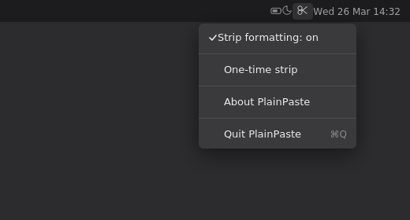
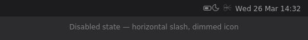

# ✂ PlainPaste

A tiny macOS menu-bar utility that **automatically strips rich-text formatting** from your clipboard. Every paste becomes plain text — no more fighting with fonts, colors, and sizes when pasting between apps.






## How it works

PlainPaste sits in your menu bar and watches the clipboard. Whenever you copy something that contains rich text (RTF or HTML), it instantly replaces it with the plain-text equivalent. You just copy and paste normally — formatting is gone.

## Menu bar icon

PlainPaste uses the **SF Symbol `scissors`** (✂) as its menu bar icon. It renders as a native template image that automatically adapts to light mode, dark mode, and the menu bar's vibrancy — just like a built-in macOS icon.

When you disable stripping, a horizontal line is drawn through the scissors and the icon dims so you can tell at a glance.

## Quick start

### Option A: Build from source (30 seconds)

```bash
git clone https://github.com/YOUR_USER/PlainPaste.git
cd PlainPaste
make run          # compiles and launches immediately
```

### Option B: Install as an app

```bash
make install      # builds PlainPaste.app → ~/Applications/
open ~/Applications/PlainPaste.app
```

### Option C: Download a release

Grab the latest `PlainPaste.zip` from the [Releases](../../releases) page, unzip it, and drag `PlainPaste.app` to your Applications folder.

## Menu bar options

| Item                     | What it does                                |
| ------------------------ | ------------------------------------------- |
| **Strip Formatting: On** | Toggle auto-stripping on / off              |
| **One-time strip**       | Strip just this one copy (handy when auto-stripping is off) |
| **About PlainPaste**     | Version info                                |
| **Quit PlainPaste**      | Exit the app                                |

## Launch at login

1. Open **System Settings → General → Login Items**
2. Click **+** and select `PlainPaste.app` from `~/Applications`

## Building

The only requirement is a Mac with **Xcode command-line tools** installed:

```bash
xcode-select --install   # if you haven't already
```

Then use the Makefile:

```bash
make compile      # compile the binary to build/PlainPaste
make bundle       # create build/PlainPaste.app
make install      # copy PlainPaste.app to ~/Applications
make run          # compile + run immediately (no install)
make clean        # remove build artifacts
```

## CI / Releases

The included GitHub Actions workflow (`.github/workflows/build.yml`) will:

- **On every push / PR** — build the app and upload `PlainPaste.zip` as a workflow artifact.
- **On a tagged release** — attach `PlainPaste.zip` to the GitHub Release.

To cut a release:

```bash
git tag v1.0.0
git push origin v1.0.0
```

The Action will automatically create a GitHub Release, generate release notes from commits, and attach the zip. No manual steps needed.

## Requirements

- macOS 11 Big Sur or later (for SF Symbols)
- Xcode Command Line Tools

## License

MPL-2.0 — See [LICENSE](LICENSE) for details.
